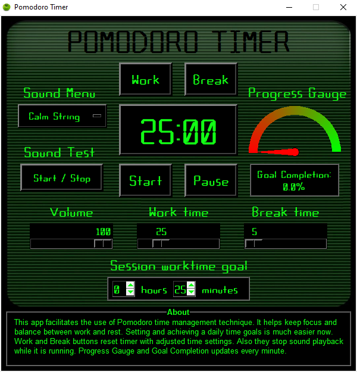

# POMODORO TIMER
#### Video link

### Application preview

### Reason for creating Pomodoro Timer

Pomodoro Timer might be useful for anyone who wants to improve his overall productivity. It helps control time spent on any task 
and keep focus. The app is based on Pomodoro Technique which was created by Francesco Cirillo in the late 1980s. Its idea is 
based on few rules:
1.	Consider how much time does a task need to be done.
2.	Keep focus while completing the task.
3.	Make breaks to get a clear head.
4.	Count time spent on a task and breaks. 
5.	Make regular reviews to track progress.
6.	Use this technique to achieve personal goals.

While creating this app I was learning Tkinter package for creation of GUI apps. This knowledge will help sharing my scripts 
with clients or coworkers in the future.

### App platform, dependencies

Firstly, ‘Calculator.ttf’ font should be installed in a system before running the app. Application was created on Windows 10 
platform and has not been tested on other platforms. Since Tkinter is available on most Unix platforms, including macOS, anyone 
might use code of the app and create same app on different platform. At least I believe so…

The app is made with Python Tkinter package. Initially I tried to use DearPyGui package, but I had problems getting access to a 
loop. It is needed for main functionality of this app. Tkinter has this special function called ‘after’. It 
enables accessing loop while app is running. Pygame is used to play and manage sounds inside the app. Some functions from 
Math package are used to create and update Progress Gauge. Due to compatibility issues app is created with Python 3.10.8.

### App functionality

Main functionality of the app is the Timer. It counts downtime for work and break and overall time spend for work and breaks. 
Those values are used to update session goal completion. After reaching 00:00 time it plays sound chosen by user. It also triggers
updating Progress Bar and Goal Completion frame every minute. Work and Break buttons sets start times for Timer from user setup. 
Those stop and reset the Timer and sound playback. From Sound Menu user might choose different sounds. Sound Test button enables 
test of chosen sound while Timer is not running. There are three sliders. One sets volume of sound. Second sets length of work 
time and third sets break time. Each time user might start Timer with different settings. There are also two spin boxes for 
setting goal for duration of work time. “About” frame is located at the bottom of the app window. It contains short app 
description and user manual. 

### Further development

Main reason for creating Pomodoro Timer application is potential for further development. First step might be reconstruction of 
app's code using Object-Oriented Programming. For anyone who wants to train his OOP skills that would be useful.
Presenting total time of work and breaks, checkbox for timer autostart, user authentication, cloud database 
with activity tracker, saving settings, drawing time charts, analytical features - those are ideas for further development.